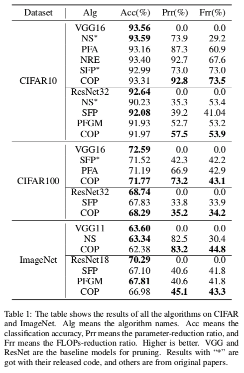
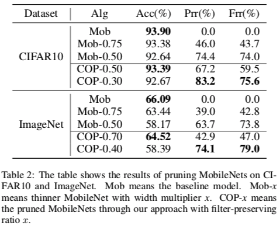

# COP: Customized Deep Model Compression via Regularized Correlation-Based Filter-Level Pruning


## Introduction

COP is a filter-level pruning algorithm for deep CNNs. It fully considers the correlation among filters and the inequivalence between saving more storage resources and computing resources during the pruning process. This repository is a Tensorflow implementation of our algorithm in IJCAI2019 paper: [**COP: Customized Deep Model Compression via Regularized Correlation-Based Filter-Level Pruning**](https://arxiv.org/abs/1906.10337)


## Requirements

Ubuntu 16.04

Python == 3.x

Tensorflow >= 1.10.0

Numpy >= 1.14.1

Older versions of dependencies are to be tested.


You are highly **recommended** to use our [docker image](https://github.com/cheerss/deep-docker/tree/9.0-cudnn7-devel-ubuntu16.04), which satisfies all the requirements above.


## Quick Start
```bash
# arguments:
#   --train_dir: the directory to save the log file and checkpoint
#   --dataset: it could be "cifar10", "cifar100" and "imagenet"
#   --data_dir: the directory to read data. 
#     - For cifar10: The data files are $data_dir/cifar-10-batches-bin/*.bin
#     - For cifar100: The data files are $data_dir/cifar-100-binary/*.bin
#     - For imagenet: The data files are $data_dir/train/* and $data_dir/validation/*(TFRecord-type)
#   --network: it could be "vgg16", "vgg11", "resnet18", "resnet32", "mobilenet_for_cifar" and "mobilenet_for_imagenet"
#   --alpha, beta, gamma: they are the coefficients when computing the importance of filts, see the paper for details
#   --prune_rate: the ratio of filters to be pruned


## to train a model
mkdir data && cd data && wget https://www.cs.toronto.edu/~kriz/cifar-10-binary.tar.gz && tar -zxvf cifar-10-binary.tar.gz
python train.py --train_dir=vgg-cifar10-model --dataset="cifar10" --data_dir="./data" --network="vgg16"

## to prune and finetune a pretrained model
train_dir=vgg-cifar10-model
python auto_prune.py --train_dir=$train_dir --dataset="cifar10" --data_dir="./data" --network="vgg16" --alpha=1.0 --beta=0.0 --gamma=3.0 --prune_rate=0.1
```

Please see `train.sh` and `train_finetune.sh` for more usage. The imagenet dataset need to transforming to TFRecord-type first, see `extra/README.md` for details.


## Compared Algorithm

[NS](https://arxiv.org/abs/1708.06519) ([code](https://github.com/liuzhuang13/slimming)): Learning Efficient Convolutional Networks through Network Slimming

[PFA](https://arxiv.org/abs/1807.10585): Network Compression using Correlation Analysis of Layer Responses 

[SFP](https://arxiv.org/abs/1808.06866) ([code](https://github.com/he-y/soft-filter-pruning)): Soft Filter Pruning for Accelerating Deep Convolutional Neural Networks

[NRE](https://www.ijcai.org/proceedings/2018/0318.pdf): Efficient DNN Neuron Pruning by Minimizing Layer-wise Nonlinear
Reconstruction Error

[PFGM](https://arxiv.org/abs/1811.00250): Filter Pruning via Geometric Median for Deep Convolutional Neural Networks Acceleration

[COP](https://arxiv.org/abs/1906.10337) (Ours): COP: Customized Deep Model Compression via Regularized Correlation-Based Filter-Level Pruning

### Results

#### Results on VGG and ResNet



#### Results on MobileNets




## Datasets and Architectures Supported

The following table shows the datasets and models which could be used directly now. You could also use other datasets and models with minor changes. Please see next section for how to experiments with your own datasets and models

|           | CIFAR10 | CIFAR100 | ImageNet |
| --------- | ------- | -------- | -------- |
| VGG11     | N       | N        | Y        |
| VGG16     | Y       | Y        | N        |
| ResNet18  | N       | N        | Y        |
| ResNet32  | Y       | Y        | N        |
| MobileNet | Y       | Y        | Y        |
| ...       |         |          |          |


## Use Your Own Models and Datasets

### Use new dataset

1. You should put your new dataset in `./datasets/`, please see `./datasets/cifar10.py` for reference.

2. A dataset is obliged to parse the dataset file, do data augmentation, and batch the dataset

3. You need to implement at least 2 interfaces, they are `train_input_fn` and `test_input_fn`, one for training and the other for test

   - `train_input_fn` should take 3 parameters, which are "data_directory", "batch_size" and "epochs" respectively, and it should return a tf.data.Dataset-type class. You should also do shuffling, data augmentation and batch internally.
   - `test_input_fn` should take 2 parameters, which are  "data_directory" and "batch_size", and it should return a tf.data.Dataset-type class too.

4. Import the new dataset to `config.py` and add the new term to `parse_net_and_dataset` in `config.py` (just mimic what CIFAR10 does).
  

Totally speaking, you should create a new file `datasets/new_dataset.py` which contains at least the following 2 functions and tell `config.py` to parse the dataset correctly. 

```
def train_input_fn(data_dir, batch_size, epochs, **kargs):
	"""
	Args:
    data_dir: the path of the dataset file
    batch_size: the batch size of the dataset
    epochs: the dataset could provide how many epochs, -1 for infinity
    **kargs: any other parameters you want
  Return:
  	dataset: an object of type tf.data.Dataset(or its sub-classes)
	"""
	pass

def test_input_fn(data_dir, batch_size, **kargs):
	"""
	Args:
    data_dir: the path of the dataset file
    batch_size: the batch size of the dataset
    **kargs: any other parameters you want
  Return:
  	dataset: an object of type tf.data.Dataset(or its sub-classes)
	"""
	pass
```


### Use new model

1. You need to create 2 new files to use a  new model, one for the definition of the model and the other for the pruning details of the model. Put the first file in `./networks/` and the second file in `./prune_algorithm/`.
  -  For the definition of the model, you should inherit from the class `ClassificationBase`, it has implement some essential functions for you. You only need to implement all abstract methods defined in `ClassificationBase`. See the comments in `ClassificationBase` for details. (You could see `./networks/vgg16` for reference).
  - For the pruning algorithm of the model, you should inherit from the class `PruneBase`, you need to implement all abstract methods defined in `PruneBase` and overload other methods if needed. See the comments in `PruneBase` for details. (You could see `./prune_algorithm/prune_vgg16` for reference).
2. Import the new model to `config.py` and parse the model correctly.


## Reference

Reference to cite when you use COP in a research paper
```
@inproceedings{wang2019cop,
  title={COP: Customized Deep Model Compression via Regularized Correlation-Based Filter-Level Pruning},
  author={Wang, Wenxiao and Fu, Cong and Guo, Jishun and Cai, Deng and He, Xiaofei},
  booktitle={International Joint Conference on Artificial Intelligence},
  volume={2019},
  year={2019},
}
```

